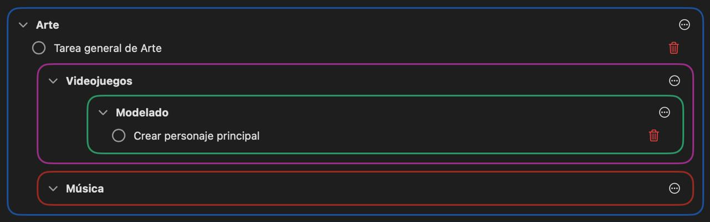

# MaiTODO

A native macOS to-do app built with SwiftUI. Todos live in an Inbox or in nested sets (folders), with local JSON persistence.

## Features

- **Inbox** for todos without a set, plus **nested sets** (a set can contain subsets) for grouping, each with its own color
- **Collapse/expand** any set to reduce clutter
- Mark todos done/undone — undoing a todo restores it to its original set
- **Double-click** a todo to edit its content inline
- **Drag and drop** todos to reorder them or move them between sets
- Assign an Inbox todo to a set via its folder menu
- Delete sets/todos via a per-item `⋯` options menu

## Screenshot

## Getting started

Open `MaiTODO.xcodeproj` in Xcode and run the `MaiTODO` scheme.

## Data

Sets and todos are persisted as JSON (`sets.json`, `todo.json`) in the app's Application Support directory.
